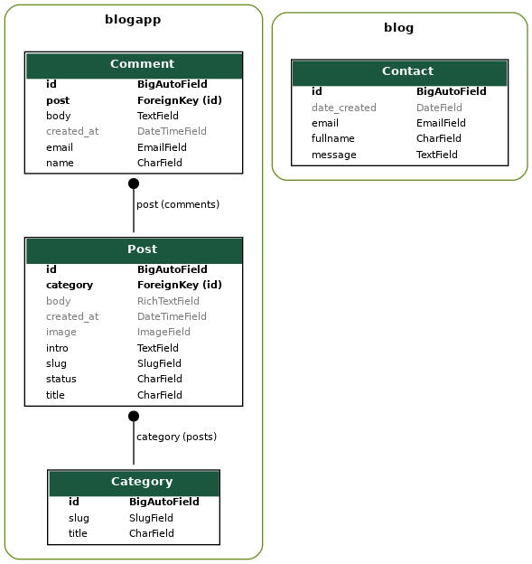

Daily Foodie is a blog which provides recipes and interesting stories about food around the world.

[View the live project here.](https://dailyfoodieblog.herokuapp.com/)

## The purpose of this site 

This site has intention of enabling users not only to read recipes and interesting food stories, but to participate by registering and leaving comments below posts.
Any site visitor can also easily contact the site owner via contact form.

The intention is to create a community of "foodies" who would share their experiences and help improving the content of the blog by leaving their comments.

## User Experience

### User Goals

**First time site visitors would like to**

 * Easily navigate on the site.
 * Read posts and see the options to sign up/login in order to leave their comments.

**Returning registered users would like**

  * View, create, edit and delete comments below posts.
  * View other user's comments.

### Site Owners Goals

 * Enable easy to navigate experience for every site visitor or user.
 * Enable any site visitor to easily create account.
 * Enable every user to easily log in.
 * Enable creation of the community of users who regularly comment below posts.
 * Enable all site visitors to contact the website owner/admin.

 ### USER STORIES

Issue No. | Title | User story | Acceptance criteria | Implemented
----------|-------|------------|---------------------|-------
#01 | Manage content | As a Site Admin I can create, edit and delete posts so that I can fully manage blog content. | Acceptance Criteria: Site admin can create, edit and delete posts. | Yes
#02 | Manage comments | As a Site Admin I can edit and delete comments so that I have full CRUD control over the comments section. | Acceptance Criteria: Site admin can edit and delete comments. | Yes
#03 | View posts | As a Site User I can view a list of posts so that I can easily select one of them to read it. | Acceptance Criteria: Site user can view a list of posts and see two categories of posts. | Yes
#04 | Access posts | As a Site User I can access one of the given posts so that I can read the whole text. | Acceptance Criteria: Site user can click and access each of the posts published. | Yes
#05 | Account creation | As a Site User I can register my own account so that I can view and leave comments. | Acceptance Criteria: Site user can register account, then view and leave comments. | Yes
#06 | Contact form | As a Site User I can contact website owner/creator so that I can ask a question/an advice or give tips to improve website. | Acceptance Criteria: Site user can fill the contact form and submit it. | Yes
#07 | Draft creation | As a Site Admin I can create drafts for my posts so that I can finish writing when I wish. | Acceptance Criteria: Site admin can change post status within admin area from active to draft and vice versa. | Yes
#08 | Comment on posts | As a Site User I can submit, edit and delete comments so that I can participate in discussions below posts. | Acceptance Criteria: Registered site user can submit, edit and delete comments when logged in. | Yes
#09 | Login possibility | As a Site User I can easily login so that I can view, submit, edit or delete comments. | Acceptance Criteria: Site user can log in easily which triggers permissions for submitting, editing and deleting comments. | Yes
#10 | Logout possibility | As a Site User I can easily logout so that I can safely use my credentials when I wish. | Acceptance Criteria: Site user can easily log off. | Yes
#11 | Search for posts | As a Site User I can search for keywords so that I can easily find a desired post. | Acceptance Criteria: Site user can search for a specific keyword within posts. | Yes

### STRATEGY

* Focus:

  The focus of this project is to provide recipes and interesting stories about food from around the world.

* Definition:

  Daily Foodie is a blog web site for visitors who want to find some new recipes or just read "foodie" stories.

* Value:

  The registered users can leave comments and see other users' comments below all posts.

**Agile software development**

Throughout development process of this site, agile development approach was taken using Trello Kanban which was transferred to Github due to technical issues (not fully transferred as I've could not save some of the features that I've created with Trello).

### SCOPE

**Features:**

  **Navigation menu** - The navigation menu is clear and consistent for all visitors and users.

  **Home page** - Home page enables visitors/users to easily switch between 2 categories of posts or use navigation menu functions.

  **Register/Login page** - Site visitors can register at register page or sign in at login page.

  **2 Category pages** -  Site visitors can access either "Recipes" or "Food Around the World" category with list of posts.

  **Post detail page** -  Any visitor can read posts, while only registered/logged in users can submit, edit or delete comments.

  **Edit/Delete comment page** - Registered users can edit/delete their own comments.

  **Contact page** – Any site visitor can contact the blog admin through this form.

  **Search page** – Any site visitor can search posts by using a keyword.

  **Admin page** - This page is restricted to the site administrator and is used for the full control of all blog features.

   **Planned Features:**
  * The site should be responsive, intuitive and easy to navigate on all devices.
  * Home page should provide easy navigation and access for both post categories.
  * Users should be able to easily register/login/logout.
  * Only registered users can view, submit, edit and delete comments.
  * Unregistered users can view the posts without comments.
  * Any user can contact site admin through contact page.

### SKELETON
  **Wireframe:**
  The basic mockup for this site was done on Balsamiq Wireframes and can be viewed below
  
  [Wireframes folder](https://github.com/jurica29/foodblog2022/tree/main/static/images/wireframes)

  **Database:**

  

Database schema

      
      

## SURFACE
  **Colour Pallette:**

  
  	
  **Typography:**

 Default fonts were used throughout the website.

### Technologies

  * HTML5 
  * CSS3 
  * Python
  * Django 
  * Cloudinary 
  * Bulma
  * FontAwesome 
  * Google Fonts
  * GitPod 
  * GitHub 
  * DevTools 
  * Heroku 
 
## Existing Features

 ### Elements on every page
 
   * Navbar

      There is a consistent navbar present for all pages within the site.
      Navbar has the site name to the left, which is clickable and returns to home page.

      * Login, Register and Contact

      

Navbar

      
      

      

Navbar mobile

      
      

  * Footer

    There is a consistent footer present for all pages within the site, containing three social media icons.

    

Footer

    
    

  
  * Home/Landing page

    Home page immediately enables visitors and users to pick between 2 categories of posts or just to scroll through them immediately.
    
    

Home

    
    

  * Post Detail page

    Every site visitor can enter and read posts.

    

Post detail

    
    

  * Comment section

    Comment section below post is restricted to registered users. They can see option to submit, edit or delete their comments.

    

Comment section

    
    

  * Edit Comment page

    Edit comment page for registered users only.

    

Edit comment

    
    

  * Delete Comment page

    Delete comment page for registered users only.

    

Delete comment

    
    

  * Search page

    Every site visitor can search for one keyword that can take them to the desired post.

    

Search

    
    

  * Register page

    This page can be opened via the register button in the navigation bar.
    New site visitors are simply asked to enter username, email address, password and password confirmation to register for the use of this site. 
    Once successfully registered, users will be redirected to the home page and have access to comments section below posts.

    

Register page

    
    

  * Login page

    Registered and returning users can use the login button to open the login page and supply their username and password to login.
    On successful login, users will be redirected to the home page and they will be aware of it due to login username displayed in the upper right navbar area.

    

Login page

    
    

    

This displays when user is logged in

    
    

  * Contact page

    Any site visitor can use contact page to reach out to the site owner.
    There are three fields that user needs to fill in: name, email and message.
    After submitting the message user will get a notification of being successful.

    

Contact page

    
    

  * Logout page

    Logout notification is very simple and it displays a message that user is logged out successfully.

    

Logout page

    
    

### Features Left to Implement

  Due to the short space of time given to complete this project, I was unable to implement following planned features:

  * Like/Unlike comments
  * Email authentication
  * Site pagination

## Testing

### Responsiveness 

The site is tested to ensure all pages are displayed appropriately in all screen sizes.

### Manual testing

  Manual testing was conducted to ensure the site works as intended. Testing document can be found here [Link to the testing document](static/documentation/testing.md)

### Errors encountered during development

  1) Minor issues with URLs, which on some occasions, were not working as intended, which were fixed via help and guidance of tutor support.
  2) Minor issue with comment box responsiveness for smaller screens, which was fixed by making it smaller in terms of rows and columns.
  3) Deployment was a bit problematic but it was fixed as some lines in settings.py were misplaced.
  
### Known error present:

  No known errors present at the time of submission

###  Validating code - Python, HTML, CSS, JS

All the .py files are validated in the PEP8 online validator.

The result screenshot of one of the file
 
 

At the time of project submission, there were no errors detected in the PEP8 validator.

No errors were returned when passing through the official W3C validator.

The result screenshot - html
 
 

No errors were found when passing through the official (Jigsaw) validator.

The result screenshot - css
 
 

Two errors were found when passing JS code through the validator, however they do not impede any functionality.

The result screenshot - JS
 
 